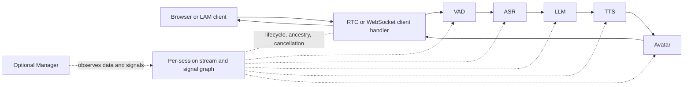
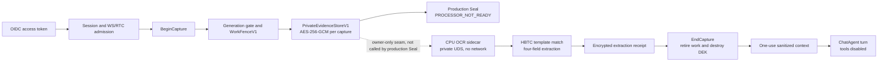

# OpenAvatarChat Technical Report

[简体中文](zh-cn/technical-report.md) | English

## 1. Executive assessment

OpenAvatarChat 0.6.0 is a modular real-time digital-human service built around
configuration-selected handlers. A browser or LAM client supplies audio, video,
or text; the engine routes typed streams through VAD, ASR, LLM, TTS, and avatar
handlers; output returns over WebRTC or WebSocket. Standard and duplex
conversation modes use the same handler contract, with type overrides and
additional end-of-utterance/interruption handlers in duplex mode.

The architecture is appropriate for a single-process, GPU-backed interactive
service and has several useful correctness mechanisms:

- handler interfaces separate process-wide model loading from per-session
  contexts;
- stream identity, ancestry, lifecycle signals, and cancellation are explicit;
- cancelled data is guarded both before distribution and before consumption;
- session histories and manager buffers are bounded by default;
- Git submodules are pinned to commits;
- liveness, readiness, and version endpoints exist;
- dependency/model selection can be derived from a preset.

The current deployment surface is not production-ready without compensating
controls. Certificate capture is disabled by default; that legacy/default mode
retains the unauthenticated application and Manager behavior found in the
original review. Enabling certificate capture changes the security posture
materially: startup requires valid TLS, one worker, and strict OIDC; session,
WebSocket, RTC, capture, health/config, and Manager operations use purpose-bound
admission and ownership checks. This opt-in mode still has no general
rate-limiter and does not fix the unsafe/miswired bundled TURN service,
unverified generic model loading, floating dependency resolution, or unbounded
RTC output queues.

The reviewed checkout now contains admission-notice components through the M8
WebUI: capture transitions and normal work are generation-fenced, JPEG evidence
is capture-key encrypted, and private M6A OCR, M6B/M6C four-field/template, M7
sanitized-release, and M8 browser components exist with isolated tests. They are
not production-composed end to end. The production Seal path only admits a
constructor-injected test processor; it never calls the private OCR or
extraction services, so it cannot stage M7 release. Independently, no approved
production OCR lock, models, identity, or CPU qualification record is committed.
Production Seal therefore returns `PROCESSOR_NOT_READY` after the frame-count
gate even if a valid deployment manifest is supplied. Template parsing and
personalization also would not constitute document authenticity verification.

This is a readiness assessment, not a claim that the project cannot be used.
The native and Docker paths are viable for a controlled Linux GPU host after
the selected preset, models, credentials, and network path are verified. Public
operation requires the production gates in the
[deployment guide](deployment-guide.md).

## 2. Scope, method, and exclusions

### 2.1 Reviewed

- root manifests, installer, model downloaders, Dockerfile, Compose file, shell
  helpers, TLS and coturn configuration;
- all 13 checked-in YAML presets;
- first-party engine, session, stream, signal, client, service, handler, and
  manager code;
- certificate session admission, security envelopes, generation fencing,
  coordinator, encrypted private store, OCR/extraction/release code, and their
  dedicated first-party test suites;
- the CPU-only OCR sidecar package and its Compose isolation boundary;
- the prebuilt frontend boundary and frontend build/type-check state;
- handler dependency manifests and all eight Git submodule boundaries;
- English and Chinese project documentation, with the English documentation
  used as the main deployment baseline;
- current authoritative CUDA, NVIDIA Container Toolkit, Docker Compose,
  browser secure-context, WebRTC/TURN, and coturn references.

### 2.2 Treated as external

The following are pinned submodules or third-party trees and were not subjected
to a full independent implementation audit:

| Boundary | Checked-out commit |
|---|---|
| SoulX-FlashHead | `c2b0b0fb696c58c20917b50a9c572a6ac9414233` |
| LAM_Audio2Expression | `aa5bc3487ac2c915db2ff43d05d9f563cb62864d` |
| LiteAvatar | `5b7ec850945e03d56fb290b05fb68440c359fa86` |
| MuseTalk | `67e7ee3c7397bcfd03e123398e5497f31be1bf92` |
| CosyVoice | `0a496c18f78ca993c63f6d880fcc60778bfc85c1` |
| Silero VAD | `9060f664f20eabb66328e4002a41479ff288f14c` |
| Smart Turn | `7392230c2627503d0cefcaa79d60e5adbb381a54` |
| OpenAvatarChat WebUI | `b82f290c692a84d85108f03be046aa392350ca9a` |

The root repository controls how these components are loaded, configured, and
exposed, so those integration seams are in scope even where the upstream
algorithm is not.

### 2.3 Not validated end to end

No model files are present in the checkout, and no production credentials,
browser, reachable TURN server, or confirmed NVIDIA GPU were supplied.
Accordingly, this review did not:

- download multi-gigabyte models or dependencies;
- invoke a paid LLM, ASR, TTS, or managed TURN API;
- start the full media service;
- build or start the CUDA container;
- exercise browser WebRTC across a real NAT;
- measure latency, throughput, GPU memory, or multi-session capacity;
- provision or run the independently qualified Paddle/PP-OCRv6 CPU sidecar;
- complete a real-camera, real-document M8 capture and personalized-response
  flow.

The existing documentation's latency and VRAM figures are historical project
claims, not results reproduced in this review.

## 3. Repository and delivery structure

| Path | Role |
|---|---|
| `src/demo.py` | CLI and application process entry point |
| `src/chat_engine/` | handler discovery, session lifecycle, stream/signal graph, data models |
| `src/handlers/` | client, VAD, ASR, LLM, TTS, avatar, manager, and beta agent integrations |
| `src/service/` | frontend mounting, RTC/TURN providers, manager service, config/TLS/logging |
| `src/certificate_capture/` | capture lifecycle, private evidence, OCR, deterministic extraction, and one-use release |
| `services/certificate_ocr/` | isolated CPU-only OCR sidecar and qualification tooling |
| `config/` | environment-scoped runtime presets |
| `tests/service/` and `tests/chat_engine/` | first-party security, fencing, capture, extraction, release, and service tests |
| `scripts/` | model/avatar downloads, TLS creation, coturn setup |
| `resource/` | avatar assets mounted or copied at runtime |
| `models/` | downloaded model root; ignored by Git |
| `build/` and `exp/` | generated/runtime output |
| `extensions/openclaw/` | optional beta bridge; not part of the core deployment path |
| `docs/` | VitePress user documentation |
| `Dockerfile` | CUDA 12.8.1 all-handler image |
| `docker-compose.yml` | application plus host-network coturn scaffold |

The source checkout itself is about 9.3 GB in this environment because
submodules and local environments are populated. This is not an image-size or
deployment-disk estimate; model directories are empty and production models
add substantial, preset-dependent storage.

## 4. Runtime architecture

### 4.1 System flow



Typed data, rather than a hard-coded call chain, connects handlers. A handler
declares the `ChatDataType` values it consumes and produces. The session creates
input sinks and output streamers from those declarations, so a producer can
fan out to all eligible consumers without knowing their concrete classes.

Source anchors:

- handler contract: [`handler_base.py`](../src/chat_engine/common/handler_base.py#L16);
- session wiring: [`chat_session.py`](../src/chat_engine/core/chat_session.py#L92);
- stream graph: [`stream_manager.py`](../src/chat_engine/core/stream_manager.py#L1390).

### 4.2 Boot sequence

1. `src/demo.py` parses `--host`, `--port`, `--config`, and `--env`.
2. `OPEN_AVATAR_CHAT_CONFIG`, when present, replaces the CLI config path.
3. Dynaconf loads the requested environment and `.env`.
4. Pydantic validates only `logger`, `service`, and `chat_engine`.
5. The logger is configured for stdout plus rotating `logs/log.log`.
6. FastAPI and a Gradio placeholder are created.
7. `ChatEngine.initialize()` imports, validates, registers, and loads handlers.
8. Client and manager handlers mount routes and frontend assets.
9. The engine marks itself ready.
10. TLS paths are checked; Uvicorn starts with TLS only when both files exist.

Source anchors:

- CLI and process: [`demo.py`](../src/demo.py#L32);
- config load: [`service_config_loader.py`](../src/service/service_utils/service_config_loader.py#L27);
- handler load: [`handler_manager.py`](../src/chat_engine/core/handler_manager.py#L38);
- TLS selection: [`ssl_helpers.py`](../src/service/service_utils/ssl_helpers.py#L95).

An important ordering detail is that readiness becomes true after handler
initialization, but it does not verify TURN reachability, model completeness
beyond what individual loaders check, certificate validity, external API
credentials, or a browser media path.

### 4.3 Configuration semantics

All shipped files contain a `default` Dynaconf environment. The effective
objects are:

```text
default.logger        -> LoggerConfigData
default.service       -> ServiceConfigData
default.chat_engine   -> ChatEngineConfigModel
```

Key behavior:

- relative config paths resolve from the project root;
- relative model paths are converted to absolute paths during engine init;
- `handler_search_path` controls dynamic local module discovery;
- handler configs are first parsed as a common base, then as the handler's own
  model during registration;
- `enabled: false` prevents registration and dependency/model selection;
- `input_type_override` and `output_type_override` adapt ordinary handlers to
  duplex data types;
- the engine-level `concurrent_limit` is copied into every registered handler,
  overriding any handler-level value;
- custom config files and `.env` are trusted inputs because they control module
  loading, endpoints, credentials, model paths, and prompts.

The Pydantic fallback service defaults are `127.0.0.1:8080`, but every shipped
preset explicitly binds `0.0.0.0:8282`, except the beta agent preset on
`0.0.0.0:8283`. Documentation should therefore describe preset behavior rather
than the model fallback as the deployed default.

The top-level `history` blocks in duplex presets are not loaded into any
validated configuration object. Sessions construct `SessionHistory` with
hard-coded defaults. See finding F-12.

### 4.4 Handler lifecycle

A handler has two scopes:

- **process scope** — constructed once, registered once, and `load()` is called
  once; expensive models generally live here;
- **session scope** — `create_context()`, `start_context()`, `handle()`, and
  `destroy_context()` manage state for one conversation.

Load order is determined by `HandlerBaseInfo.load_priority`. Manager handlers
can load early to observe data. Client handlers are prepared after all
non-client handlers so that session routing is available before media begins.

Handler configuration validation errors in the first common-model pass are
logged and skipped rather than failing startup. Import failures and handler
load failures propagate. This mixed fail-open/fail-closed behavior means
operators must inspect startup logs and the expected registered-handler list.

The separate `LogicManager` exists, but session logic construction is commented
out in `ChatEngine._create_session()`. Current presets implement interruption as
a handler under `src/handlers/logic/`, not as an active `LogicManager` graph.

### 4.5 Session, threading, and shutdown

Each session owns:

- a monotonic session clock;
- a shared `active` flag;
- one `SignalManager` with a distributor thread;
- one `StreamManager`;
- one input queue and one non-daemon pump thread per enabled handler;
- per-session handler contexts;
- an in-memory `SessionHistory`.

The handler pump polls its queue every 30 ms. It catches exceptions from
`handler.handle()` and continues with the next item. Signal listener exceptions
are not caught inside `SignalManager`, so one listener failure can terminate
the session's signal-distribution thread.

Legacy session stop clears the active flag, joins pump threads, destroys handler
contexts, stops the signal thread, and clears handlers. Secure sessions now add
bounded work retirement, queue/transport teardown, capture cleanup, and
quarantine of cancellation-resistant work. Engine-wide asynchronous shutdown
retires secure sessions before process-scope handlers are destroyed; full
legacy-preset shutdown acceptance remains outstanding.

At module exit, `src/demo.py` calls `os._exit(exit_code)` from a `finally`
block. Explicit certificate configuration/startup errors set `exit_code=1`,
but arbitrary startup/runtime exceptions can still leave the default zero and
the forced exit bypasses destructors and buffered-log flushing. A missing-config
startup probe reproduced exit code zero.

Source anchors:

- session start/stop: [`chat_session.py`](../src/chat_engine/core/chat_session.py#L1289);
- signal thread: [`signal_manager.py`](../src/chat_engine/core/signal_manager.py#L59);
- engine shutdown: [`chat_engine.py`](../src/chat_engine/chat_engine.py#L1033).

This model assumes one application process. Running multiple Uvicorn workers
would create independent model instances, session dictionaries, manager hubs,
and GPU allocations, with no shared routing or session affinity. It is not a
supported scaling mechanism.

### 4.6 Streams, cancellation, and duplex behavior

A stream records:

- producer and data type;
- lifecycle status;
- direct source streams;
- ordered ancestors;
- cancelable ancestors;
- downstream references;
- ordinary and inheritable metadata.

Cancellation can propagate through the graph. The implementation checks for a
cancelled stream immediately before sink distribution and again before a
consumer calls its handler. This protects against both late producer writes
and data already queued at the time of interruption.

Finished streams are retained briefly to allow downstream handlers to link
ancestry. Stream storage periodically recycles unreferenced finished/cancelled
streams.

Standard mode is broadly:

```text
MIC_AUDIO -> Silero VAD -> HUMAN_AUDIO -> ASR -> HUMAN_TEXT
HUMAN_TEXT -> LLM -> AVATAR_TEXT -> TTS -> AVATAR_AUDIO
AVATAR_AUDIO -> avatar -> AVATAR_VIDEO + AVATAR_AUDIO -> client
```

Duplex mode adds continuous VAD, `HUMAN_DUPLEX_AUDIO` and
`HUMAN_DUPLEX_TEXT`, Smart Turn EOU, semantic interruption judgment, session
history, and interruption signals. Type overrides let SenseVoice and other
ordinary handlers operate on duplex types without changing their internal
contract.

### 4.7 RTC and WebSocket transports

#### RTC

The RTC client mounts a FastRTC bidirectional audio/video service. It uses:

- microphone input: 16 kHz, mono;
- avatar audio output: 24 kHz, 480-sample frames;
- browser camera input and avatar video output;
- configured video FPS;
- a 0.5-second media start delay;
- a connection TTL, usually 900 seconds;
- an optional ICE/TURN configuration.

Audio/video output crosses from handler pump threads into `asyncio.Queue`
instances consumed by the WebRTC event loop. The queues are unbounded and the
producer does not use an event-loop-safe bridge; this is a material slow-client
and concurrency risk (F-06).

#### WebSocket and LAM

The generic WebSocket client and LAM client expose
`/ws/session/{session_id}`. If the session does not exist, connecting creates
it in legacy/default mode, where no authentication binds a session ID to a
principal. In enabled certificate mode the handshake must present exactly one
single-use admission ticket in the `Sec-WebSocket-Protocol` value before the
connection is accepted or session state is created.

LAM supports:

- `rtc` upstream for browser audio/video plus WebSocket downstream motion data;
- `ws` for pure WebSocket input/output;
- `/download/lam_asset/{file_name}` for the configured asset archive.

The LAM asset route restricts filenames to a conservative character set and
checks the resolved path, which is a useful path-traversal control.

### 4.8 State and persistence

| State | Location | Persistence |
|---|---|---|
| Active sessions | process memory (`ChatEngine.sessions`) | Lost on restart |
| Stream graph | per-session memory | Lost on session stop/restart |
| Standard LLM history | per-session handler context | Lost on restart |
| Duplex session history | per-session memory | Lost on restart; persistence methods are placeholders |
| Manager recent events | process memory, bounded deque | Lost on restart |
| Manager audio/images | `temp/data_tool/<session>/` | Files remain until externally removed |
| Certificate frames/OCR/extraction | capture-scoped AES-256-GCM ciphertext in process memory | DEK destroyed before ciphertext/index cleanup on End, timeout, disconnect, failure, or replacement |
| Sanitized admission context | one typed post-capture continuation in the owner-only M7 composition | One ChatAgent generation only; never stored directly in history/memory; not reachable from production Seal |
| Logs | stdout and `logs/log.log*` | File/container-log retention dependent |
| Models | `models/` and handler-specific paths | Persistent volume/local disk |
| Avatar resources | `resource/` | Persistent volume/local disk |
| Build/experiment output | `build/`, `exp/` | Persistent only when mounted |

The Manager context marks buffers for expiry, but cleanup occurs when session
count exceeds the service limit; temporary media files have no corresponding
automatic retention cleanup in the reviewed code.

### 4.9 HTTP and network surface

| Surface | Default path/port | Legacy/default mode | Enabled certificate mode |
|---|---|---|---|
| Main UI/assets | `/`, `/ui/*` | Public static files; `/gradio` mounted | Public static files; legacy Gradio omitted |
| Frontend init config | `/openavatarchat/initconfig` | No application auth | Bearer token with `certificate:capture` |
| Version/liveness/readiness | `/version`, `/liveness`, `/readiness` | No application auth | Bearer token with `oac:manager`; readiness still means engine initialization only |
| RTC signalling | FastRTC legacy routes | No project auth | Only app-owned `/webrtc/offer`, with OIDC/session/transport admission |
| Generic/LAM session | `/ws/session/{session_id}` | No project auth; may create/reuse session | One-use `oac.cert-admission.v1` WebSocket subprotocol ticket before accept |
| LAM asset | `/download/lam_asset/{file_name}` | Selected configured archive | Only the configured public asset name is admitted |
| Session control | `/api/v1/session-capabilities`, `/api/v1/sessions/...` | Not mounted | OIDC `certificate:capture`, opaque capabilities, one-use transport tickets |
| Certificate capture | five routes under `/api/v1/sessions/{session_id}/certificate-captures` | Not mounted | OIDC ownership plus session/capture capabilities; no OCR/result endpoint |
| Manager WS ticket | `POST /api/v1/manager/websocket-admission-tickets` | Not mounted | Bearer `oac:manager`; returns a `no-store` one-use ticket. The sole Manager `Sec-WebSocket-Protocol` token must be `oac.manager-admission.v1.<admission_ticket>` |
| Manager stream/file | `/ws/manager/data_tool`, `/download/manager/data_tool/file` | No project auth | OIDC `oac:manager`; one-use WebSocket ticket before accept |
| App listener | TCP `8282` (`8283` in beta preset) | Direct exposure unsafe | Direct exposure still unsafe; no built-in rate limit |
| TURN and relay | `3478`, `5349`, intended UDP `49152-65535` | TURN credential | Unchanged; must be separately hardened and matched to firewall/client config |

The enabled-mode scopes are intentionally separate: `certificate:capture`
cannot authorize Manager operations, and `oac:manager` cannot authorize
certificate control. Admission tokens and capabilities are kept out of query
strings and responses use `no-store`.

### 4.10 Secure admission-notice components and missing production composition



Milestones 1A–1E supply fail-closed startup, strict `at+jwt` validation,
server-owned session authority, authenticated WS/RTC admission, and
purpose-separated Manager authorization. M2 prevents certificate-private
payloads from reaching ordinary sinks in the trusted-handler process model.
M3/M3B add exact-parent generation fencing at dequeue, external calls,
callbacks, mutation, storage, and WS/RTC egress. M4A/M4B add the capture
coordinator and five private routes; normal inputs are dropped during capture
transitions rather than buffered.

M5A stores JPEG evidence and auxiliary records under one capture DEK using
AES-256-GCM with monotonic nonces and identity-bound AAD. M6A performs private
CPU OCR and stores only encrypted `OcrPageResultV1`; M6B extracts exactly
`name`, `source_province`, `college`, and `major` with
`FOUND | AMBIGUOUS | NOT_FOUND`; M6C accepts only
`hbtc_admission_notice_v1` for `湖北交通职业技术学院`. Matching is parser
compatibility only. The dedicated
[certificate extractor module reference](certificate-extractor.md) documents
the pure parser, template matcher, private service, field rules, encrypted
contract, and stable failure outcomes.

M7's owner-only composition reparses encrypted extraction at EndCapture and may
release only `FOUND` values plus the server-owned institution name into
`SanitizedAdmissionContextV1`. It commits only after private-key destruction,
cleanup, successor-generation validation, and normal-admission reopen. The
context is one-use, omitted from direct history/memory storage, and cannot
enable tools. M8 adds an in-memory WebUI workflow for one to three JPEGs,
camera-track handoff, bounded image preparation, polling, cleanup, and ordinary
unavailable-state handling; the browser never receives OCR, extraction, or M7
context.

These M6A–M7 services are exposed only through coordinator-owner seams and
isolated/test composition. Current production `SealCapture` checks for a
constructor-injected `_test_processor_v1`, launches only the mock processor
operation, and never invokes the installed OCR or extraction service. Loading a
valid OCR deployment manifest can stage a service candidate but cannot make
Seal start production processing or reach M7.

There is deliberately no public OCR/extraction/result API, arbitrary school
profile, authenticity/issuer check, remote OCR fallback, local browser OCR, or
production success simulation. In this checkout, production Seal must fail with
`PROCESSOR_NOT_READY` regardless of manifest availability. A future release
must both integrate the production Seal-to-OCR/extraction/release chain and pass
the separate real CPU qualification.

## 5. Component and preset matrix

### 5.1 Handler families

| Stage | Implementations present |
|---|---|
| Client | FastRTC, generic WebSocket, LAM WebSocket/RTC |
| VAD / EOU | Silero standard, Silero duplex, Smart Turn |
| ASR | SenseVoice local, Bailian streaming |
| LLM / S2S | OpenAI-compatible, Dify, Qwen-Omni, semantic turn detector |
| TTS | Bailian CosyVoice, local CosyVoice, Edge TTS |
| Avatar | no-avatar, LiteAvatar, LAM, MuseTalk, FlashHead |
| Operations | Interrupt handler, optional Manager data tool |
| Beta | Perception/Chat Agent and OpenClaw bridge |

### 5.2 Checked-in presets

`Runtime config` below refers to the real Dynaconf/Pydantic configuration-load
path, not merely the installer's separate PyYAML dependency scan.

| Preset | Client / mode | ASR | Response | Avatar | Limit | Runtime config |
|---|---|---|---|---|---:|---|
| `chat_with_openai_compatible_bailian_cosyvoice.yaml` | RTC standard | SenseVoice | OpenAI-compatible + Bailian TTS | LiteAvatar | 2 | Valid |
| `chat_with_openai_compatible_bailian_cosyvoice_duplex.yaml` | RTC duplex | SenseVoice | OpenAI-compatible + Bailian TTS | LiteAvatar | 2 | Valid |
| `chat_with_openai_compatible.yaml` | RTC standard | SenseVoice | OpenAI-compatible + local CosyVoice | LiteAvatar | default 1 | Valid |
| `chat_with_openai_compatible_edge_tts.yaml` | RTC standard | SenseVoice | OpenAI-compatible + Edge TTS | LiteAvatar | 1 | Valid |
| `chat_with_openai_compatible_bailian_cosyvoice_musetalk.yaml` | RTC standard | SenseVoice | OpenAI-compatible + Bailian TTS | MuseTalk | 1 | Valid |
| `chat_with_openai_compatible_bailian_cosyvoice_musetalk_duplex.yaml` | RTC duplex | SenseVoice | OpenAI-compatible + Bailian TTS | MuseTalk | 3 | Valid, but capacity unverified |
| `chat_with_openai_compatible_bailian_cosyvoice_flashhead.yaml` | RTC standard | SenseVoice | OpenAI-compatible + Bailian TTS | FlashHead | 1 | Valid |
| `chat_with_openai_compatible_bailian_cosyvoice_flashhead_duplex.yaml` | RTC duplex + Manager | SenseVoice | OpenAI-compatible + Bailian TTS | FlashHead | 1 | Valid; Manager must be protected |
| `chat_with_lam.yaml` | LAM WebSocket standard | SenseVoice | OpenAI-compatible + Bailian TTS | LAM | 5 | Valid, capacity unverified |
| `chat_with_lam_duplex.yaml` | LAM WebSocket duplex | SenseVoice | OpenAI-compatible + Bailian TTS | LAM | 5 | Valid, capacity unverified |
| `chat_with_lam_bailian_asr_duplex.yaml` | LAM WebSocket duplex + Manager | Bailian ASR | OpenAI-compatible + Bailian TTS | LAM driver/no-avatar path | 5 | Valid; Manager must be protected |
| `chat_with_qwen_omni.yaml` | RTC standard | SenseVoice + Qwen S2S | Qwen-Omni audio/text | LiteAvatar | 1 | **Invalid: duplicate `connection_ttl`** |
| `chat_with_openai_compatible_bailian_cosyvoice_flashhead_duplex_agent.yaml` | RTC duplex beta | SenseVoice | Chat Agent + Bailian TTS | FlashHead | 1 | Valid natively; container caveat |

The installer dry-run resolved dependencies for all 13 because it uses PyYAML,
which silently keeps the later duplicate key. Dynaconf rejects the Qwen preset.
This is why both checks are required.

### 5.3 Beta Agent/OpenClaw boundary

The beta preset uses port `8283` and can start a callback listener on `8011`.
The callback token is empty by default. The Dockerfile also does not copy
`src/handlers/agent/pyproject.toml` into the dependency-discovery layer, so the
image's `install.py --all` does not install its `mcp` dependency. Treat this
preset as native-development-only until the container dependency and callback
security issues are resolved.

No further OpenClaw operational detail is included here because it is not a
critical deployment target for this review.

## 6. Models, dependencies, and build behavior

### 6.1 Python/CUDA contract

- Python: `>=3.11.7,<3.12`.
- PyTorch/Torchvision/Torchaudio: `2.8.0` / `0.23.0` / `2.8.0`.
- PyTorch wheel index: CUDA 12.8.
- Container base: CUDA `12.8.1`, cuDNN development image, Ubuntu 22.04.
- ONNX Runtime GPU: approximately `1.20.2`.

The root package name/version (`open-video-chat` 0.1.0), application endpoint
version (0.6.0), and image `APP_VERSION` (Git branch/commit generated by the
build script) are separate identifiers. Release/rollback procedures must
record the Git commit and image digest rather than relying on one version
string.

### 6.2 Dependency installation

`install.py`:

1. locates handler directories from one or more configs, or scans all handler
   manifests;
2. parses each handler's dependency list with a line-oriented parser;
3. applies global version overrides and CPU-to-GPU package replacement;
4. injects protected Torch versions;
5. installs normal requirements together;
6. installs `flash-attn`/`openai-whisper` without build isolation;
7. installs Hugging Face download tooling.

This is useful conflict management, but it is not locked resolution.
`uv.lock` is ignored by Git and excluded from the Docker context. A locally
current ignored lock therefore does not make source delivery reproducible.

The image installs dependencies for all copied handler manifests, not only the
deployed preset. That increases build time, native-extension complexity, attack
surface, and image size. A future production design should use
preset-specific images or optional dependency groups.

The Docker build context also excludes every `*.yaml` and `*.yml` through broad
rules in `.dockerignore`. Those rules apply below `src/`, not only to Kubernetes
files. For example, FlashHead imports
`flash_head/configs/infer_params.yaml` at module load, but that file is excluded
before `COPY ./src`. LiteAvatar, MuseTalk, local CosyVoice, and other submodules
also contain runtime YAML. A successful stock image build therefore does not
prove that the copied handler trees are runnable.

### 6.3 Model locations

| Handler | Important locations |
|---|---|
| LiteAvatar | handler submodule `weights/`; selected avatar under `resource/avatar/liteavatar/<id>/` |
| LAM | `models/wav2vec2-base-960h`, `models/LAM_audio2exp` |
| MuseTalk | `models/musetalk`, `models/sd-vae`, `models/face-parse-bisent`, S3FD cache |
| Smart Turn | exact preset path `models/smart_turn/smart-turn-v3.1-cpu.onnx` |
| FlashHead | `models/SoulX-FlashHead-1_3B`, `models/wav2vec2-base-960h` |

The downloader supports ModelScope, Hugging Face, a third-party Hugging Face
mirror, Git clone, OSS, and direct archive extraction. It does not pin immutable
model revisions or validate artifact digests.

## 7. Security, privacy, and trust boundaries

### 7.1 Trusted inputs

- repository source and pinned submodule commits;
- selected YAML config and its dynamic module paths;
- `.env` and process environment;
- locally mounted models and avatar resources;
- TLS/TURN configuration and credentials;
- OIDC issuer/JWKS/audience configuration and the server-owned HBTC template
  identity;
- reviewed certificate OCR identity, model hashes, qualification record, and
  deployment manifest when that future production bundle is provisioned;
- prebuilt frontend files.

### 7.2 Untrusted inputs

- browser/WebSocket clients and their media/text/session IDs;
- captured JPEG bytes and all OCR-derived document text;
- public HTTP/WebSocket requests;
- upstream LLM/TTS/ASR output;
- model registries, mirrors, and mutable model artifacts;
- Manager viewers when the endpoint is exposed;
- remote peers reachable through TURN.

### 7.3 Secret paths

Normal presets read `DASHSCOPE_API_KEY`; optional paths read `DIFY_API_KEY`,
`SEMANTIC_LLM_EAS_TOKEN`, and `INTERRUPT_JUDGE_LLM_EAS_TOKEN`. TURN username,
credential, provider tokens, OIDC access tokens, session/admission/capture
capabilities, and the private evidence DEK are runtime secrets.

Do not place API keys directly in YAML when Manager is enabled:
`HandlerDataTool` serializes `engine_config`, and any WebSocket client receives
the current config snapshot. TURN config is also logged in full at INFO,
including static credentials. Secrets should be injected at runtime, excluded
from config snapshots/logs, and protected by filesystem/container secret
controls.

### 7.4 Conversation data

The standard LLM handler logs complete user input and response chunks at INFO.
Manager mode stores text/audio/image observations and writes media beneath
`temp/data_tool`. The beta agent logs portions of memory write-back content.
Production operation therefore needs an explicit transcript/media/log
retention and access policy.

Certificate frames, OCR spans, extraction candidates, and M7 structured context
must not enter these generic paths. Capture/release logs are restricted to
stable reason codes, policy version, opaque release identity, field count,
lifecycle state, and duration; they must not contain released values, prompts,
capabilities, or private-store provenance.

<a id="prioritized-findings"></a>

## 8. Prioritized findings

Severity reflects impact if the documented deployment is followed. Confidence
is high for all findings below unless marked otherwise.

### F-01 — Critical: legacy/default mode has no public-service admission control

**Evidence:** certificate capture defaults to disabled. In that mode presets
still bind `0.0.0.0`, and legacy FastRTC/WS/frontend behavior is preserved
without application authentication. Enabled mode instead installs strict OIDC,
session capability, one-use WS/RTC admission, and ownership checks.

**Trigger:** publish `8282`/`8283` directly, including through the documented
port mapping.

**Impact:** anonymous users can consume GPU capacity and paid API credentials,
occupy the low concurrency limit, and use the conversational service.

**Required gate:** for legacy mode, authenticated TLS ingress, session
admission, rate/concurrency limits, and a firewall that prevents direct access
to the application listener. Enabled certificate mode covers admission but
still needs ingress rate limits, quotas, and listener isolation.

### F-02 — High: Manager is unauthenticated in legacy/default mode

**Evidence:** in legacy/default mode the Manager WebSocket and file route retain
their compatibility behavior. In enabled certificate mode, HTTP Manager
operations require an OIDC token with `oac:manager`, and the Manager WebSocket
must consume a purpose-bound one-use admission ticket before accept.

**Trigger:** enable `Manager` and expose the service.

**Impact:** any client can receive all-session snapshots/current configuration,
download known temporary media paths, and remotely interrupt sessions. Inline
handler API keys can be included in the configuration snapshot. Each Manager
subscriber also receives an unbounded async queue, and generated media paths
join an unvalidated session ID beneath the nominal base directory; depending on
the client/proxy path, a crafted ID can escape that directory.

**Required gate:** isolate or disable Manager in legacy production, or add
server-side authorization at ingress/application level. For enabled mode,
validate both authorized and denied paths, keep `oac:manager` separate from
`certificate:capture`, bound subscriber queues, and retain path containment.

### F-03 — High: bundled coturn credentials and exposure are unsafe

**Evidence:** [`turnserver.conf`](../coturn-data/turnserver.conf#L5) contains
`admin:admin`, listens on all interfaces, and is used with host networking;
`setup_coturn.sh` writes `username:password`.

**Trigger:** start the provided TURN service on an Internet-reachable host.

**Impact:** public credentials enable relay/bandwidth abuse and resource
exhaustion.

**Required gate:** unique rotated or time-limited credentials, deliberate realm
and listener addresses, quotas, a bounded relay range, peer restrictions,
firewall rules, and monitored logs. Never deploy checked-in credentials.

### F-04 — High: Compose TURN/TLS is miswired and not advertised to clients

**Evidence:** [`docker-compose.yml`](../docker-compose.yml#L12) mounts
`localhost.crt` as both TURN certificate and private key. The selected app
config has no `turn_config`, and
[`client_handler_rtc.py`](../src/handlers/client/rtc_client/client_handler_rtc.py#L484)
only sends ICE configuration when one is supplied.

**Trigger:** use `docker compose up` expecting public/NAT WebRTC to work.

**Impact:** TURN-over-TLS cannot load a valid key; browsers receive no TURN
server entry; restrictive NAT clients remain stuck.

**Required gate:** mount the actual key, correct/validate coturn config, add
`RtcClient.turn_config`, and verify ICE relay candidates from an external
network.

### F-05 — High: unsafe model deserialization plus unverified mutable downloads

**Evidence:** [`demo.py`](../src/demo.py#L40) globally forces
`torch.load(..., weights_only=False)` unless a caller explicitly passes `True`.
[`download_models.py`](../scripts/download_models.py#L134) does not pin model
revisions or validate checksums.

**Trigger:** compromised registry/mirror, modified model volume, or unintended
artifact is loaded.

**Impact:** a malicious pickle-compatible model can execute code as the service
user; the container currently runs as root and holds secrets/mounted data.

**Required gate:** verified immutable artifacts, safe formats or
`weights_only=True`, isolation for unavoidable legacy models, and a non-root
runtime.

### F-06 — High: RTC queues are unbounded and cross threads unsafely

**Evidence:** handler pump threads call `asyncio.Queue.put_nowait()` in
[`client_handler_rtc.py`](../src/handlers/client/rtc_client/client_handler_rtc.py#L731);
the WebRTC loop awaits those queues in
[`rtc_stream.py`](../src/service/rtc_service/rtc_stream.py#L346).

**Trigger:** normal concurrent output or a stalled/slow client.

**Impact:** missed wakeups/races can stall media; queued audio/video can grow
without bound and exhaust memory.

**Required gate:** an event-loop-safe bridge, bounded queues, stale-video drop
policy, bounded audio latency, and slow-client tests.

### F-07 — High: Docker build context strips handler runtime YAML

**Evidence:** [`.dockerignore`](../.dockerignore#L170) excludes `*.yaml` and
`*.yml` globally, while the Dockerfile later copies `src`. FlashHead explicitly
changes into its submodule because the upstream import opens
`flash_head/configs/infer_params.yaml`; that required file matches the ignore
rule.

**Trigger:** build the stock image and enable a handler whose source/runtime
assets include YAML.

**Impact:** the image can build successfully but fail during handler import or
model initialization. FlashHead is a directly confirmed dependency; several
other bundled submodules also contain YAML assets and require preset-specific
verification.

**Required gate:** scope ignore rules to true build-only paths or re-include
runtime YAML beneath `src`; then inspect/test the final image for every selected
handler.

### F-08 — Medium: shipped RTC/avatar FPS differences need integration validation

**Evidence:** `ClientRtcConfigModel` describes output FPS as matching the avatar
handler. MuseTalk enforces equality and its presets set `24`/`24`. Other avatar
modes do not have that runtime guard. Most LiteAvatar and non-agent FlashHead
presets configure avatar FPS `25` but leave RTC at its default `30`.

**Trigger:** run one of the mismatched presets for a sustained conversation.

**Impact:** pacing can duplicate/drop frames or drift from 24 kHz audio timing.
The exact visible impact was not runtime-tested in this review.

**Required gate:** set both values explicitly and equal, then run a
long-duration A/V synchronization test. Add cross-handler config validation.

### F-09 — Medium: TLS fails open to plaintext

**Evidence:** [`ssl_helpers.py`](../src/service/service_utils/ssl_helpers.py#L117)
logs missing files and returns no SSL settings in legacy/default mode. Enabled
certificate mode now requires readable, matching, unencrypted certificate/key
material and fails closed before application initialization.

**Trigger:** one or both certificate files are absent or mounted incorrectly.

**Impact:** the `0.0.0.0` service still starts over HTTP; remote browser media
permissions fail, or an operator accidentally exposes plaintext traffic.

**Required gate:** explicit preflight and fail-closed policy for non-loopback
deployments; prefer trusted TLS termination at an ingress proxy.

### F-10 — Medium: builds are not reproducible

**Evidence:** broad dependency ranges, direct `uv pip install`, ignored
`uv.lock`, floating `uv`, floating base-image mirror tag, unpinned coturn image.

**Trigger:** rebuild after upstream dependency/image/index changes.

**Impact:** source-equivalent builds can differ or stop building; rollback and
incident reconstruction become unreliable.

**Required gate:** tracked reviewed lock/constraints, locked install, image
digests, artifact hashes, SBOM/provenance, and immutable release identifiers.

### F-11 — Medium: model download success checks are incomplete

**Evidence:** LiteAvatar, LAM, and FlashHead download paths can return success
after ignored command failure; Smart Turn accepts any ONNX file while presets
require a specific filename.

**Trigger:** interrupted/partial download or a different ONNX variant already
exists.

**Impact:** setup appears successful and fails later during model load or first
inference.

**Required gate:** preset-specific manifest of exact files/digests, temporary
downloads, atomic promotion, and a no-network `verify-models --config` preflight.

### F-12 — Medium: configured history retention is ignored

**Evidence:** duplex configs define `default.history`, but
[`service_config_loader.py`](../src/service/service_utils/service_config_loader.py#L27)
does not load it and
[`chat_engine.py`](../src/chat_engine/chat_engine.py#L273) creates
`SessionContext` without `HistoryConfig`.

**Trigger:** tune any history retention value in a preset.

**Impact:** capacity and privacy assumptions do not match runtime behavior.

**Required gate:** wire and test the configuration, or remove it from operational
claims. Current defaults are 1,000 events, one hour, 60-second cleanup interval.

### F-13 — Medium: legacy lifecycle cleanup still needs full acceptance

**Evidence:** secure sessions now use bounded generation retirement,
capture/transport cleanup, quarantine, and asynchronous engine shutdown.
However, these changes do not by themselves prove every legacy handler,
third-party context, or process-exit path cleans up transactionally.

**Trigger:** process shutdown with active sessions, or client context
preparation failure.

**Impact:** resources/threads may depend on forced process exit; a failed start
can leave a partially registered session until restart/manual cleanup.

**Required gate:** retain the secure lifecycle suites, then run SIGTERM,
failed-context, cancellation-resistant handler, and process-exit tests for every
selected production preset.

### F-14 — Medium: readiness and container isolation are insufficient

**Evidence:** readiness only checks `states.inited`; the image runs as root;
Compose mounts secrets/config/models read-write and has no health checks or
resource limits.

**Trigger:** missing model/certificate/TURN/API prerequisite or runtime
compromise.

**Impact:** traffic can reach a functionally unavailable instance; compromise
has unnecessary write access.

**Required gate:** prerequisite-aware health checks, non-root UID, read-only
mounts where possible, dropped capabilities, `no-new-privileges`, and bounded
CPU/memory/GPU/session resources.

### F-15 — Medium: Qwen-Omni preset cannot load

**Evidence:** `connection_ttl` occurs at both lines 17 and 19 of
[`chat_with_qwen_omni.yaml`](../config/chat_with_qwen_omni.yaml#L17).
Dynaconf raises `DuplicateKeyError`.

**Trigger:** start the documented Qwen preset.

**Impact:** startup stops during configuration loading. Installer dry-run gives
a false sense of readiness because its parser keeps the later key.

**Required gate:** remove the duplicate and validate with the runtime loader.

### F-16 — Medium: sensitive content and TURN credentials are logged

**Evidence:** standard LLM input/output is logged at INFO; log files retain ten
rotations; RTC provider logs the full config including static TURN credentials.

**Trigger:** ordinary conversations or TURN-enabled startup.

**Impact:** transcripts and credentials enter file/container log pipelines.

**Required gate:** payload redaction, metadata-only production logs, secret
filtering, restrictive permissions, and an explicit retention/deletion policy.

### F-17 — Medium: process exit status masks failures and bypasses cleanup

**Evidence:** [`demo.py`](../src/demo.py) now returns exit code `1` for the
explicit certificate configuration/startup error classes, but still terminates
with `os._exit(exit_code)` and does not translate arbitrary configuration,
handler-load, or runtime exceptions into a nonzero status. The original
missing-config probe returned `0`.

**Trigger:** any startup exception, runtime exception escaping `main()`, or
normal server return.

**Impact:** CI, systemd `Restart=on-failure`, deployment automation, and
operators can treat a failed start as success. Forced exit also bypasses normal
cleanup and queued log flushing.

**Required gate:** preserve the real failure code, use orderly shutdown, and
test missing-config, invalid-config, handler-load, SIGTERM, and normal-stop
status/cleanup behavior. Until fixed, require positive readiness evidence and a
restart policy that does not depend on a nonzero code.

### F-18 — Medium: build helper evaluates a user-controlled command string

**Evidence:** [`build_cuda128.sh`](../build_cuda128.sh#L142) interpolates
`--tag` and build metadata into `BUILD_CMD`, then invokes `eval`.

**Trigger:** a build pipeline or operator passes an untrusted/malformed image
tag.

**Impact:** shell metacharacters can execute with the build user's privileges;
Docker-group access is commonly host-root-equivalent.

**Required gate:** construct the Docker command as a Bash array, remove `eval`,
validate tags/registry values, and keep untrusted PR/branch data out of
privileged build arguments.

### F-19 — Low: release identifiers and documentation drift

Examples include package `0.1.0` versus application `0.6.0`; the Manager
security behavior differing by feature mode; defaults in reference docs that
differ from Pydantic; and build-script output mentioning a `BUILD_COMMIT`
variable that the Dockerfile does not define.

**Impact:** operator confusion and unreliable support evidence.

**Required gate:** one release manifest containing Git commit, image digest,
application version, dependency lock digest, model manifest digest, and
configuration digest.

### F-20 — Low/Beta: agent container and callback defaults

The Docker dependency layer omits the agent manifest, and the beta callback
defaults to `0.0.0.0:8011` with an empty token.

**Required gate:** keep disabled, or install the missing dependency and require
a non-empty token with loopback/private binding and bounded queues.

### F-21 — Release blocker: production certificate processing is not wired or qualified

**Evidence:** the repository contains the CPU-only sidecar, strict manifests,
qualification tooling, private UDS/Compose isolation, and synthetic milestone
tests, but no approved sidecar `uv.lock`, production PP-OCRv6 artifacts,
qualified `InferenceIdentityV1`, qualification record, or real document
fixtures. More immediately, `SealCapture` admits only a constructor-injected
test processor and launches only the mock operation. The owner-only M6A OCR and
M6B/M6C extraction seams are never called by production Seal, so a valid
manifest alone cannot reach them or M7.

**Impact:** this is a deliberate fail-closed state. Production Seal returns
`PROCESSOR_NOT_READY` after the frame-count gate even with a qualified manifest;
M6A/M6B/M6C/M7 and the M8 personalized-success path cannot be exercised through
the production API. Synthetic success is component evidence, not production
composition, model quality, latency, memory, or readiness evidence.

**Required gate:** first implement and independently review the exact
production-fenced Seal-to-OCR-to-extraction-to-release composition without
exposing private results. Separately perform isolated CPU qualification, freeze
and review every hash/identity/thread/resource result, and provision the
read-only artifacts and strict deployment manifest. Then repeat security,
statistical, contention, cleanup, failure, and real-camera acceptance before
enabling production.

## 9. Quality and test posture

- The checkout now has substantial first-party suites under `tests/service/`,
  `tests/chat_engine/security/`, `tests/chat_engine/fencing/`, and milestone
  directories through M7. They cover admission, capabilities, dispatch
  isolation, exact-parent fencing, coordinator races, encrypted storage,
  OCR/UDS contracts, deterministic extraction/template matching, release, and
  ChatAgent tool suppression.
- The WebUI submodule adds M8 TypeScript tests for session state, API privacy,
  camera handoff, image bounds, and workflow, plus a checked-in production
  build.
- The root CI still does not execute this security suite. Combined pytest
  collection also has baseline top-level `conftest` and duplicate non-package
  module collisions, so milestone/service suites must be run independently.
- Synthetic fixtures and mocked/test-only processors establish deterministic
  behavior, not real Paddle/PP-OCRv6 accuracy, capacity, or end-to-end browser
  operation.
- The original 2026-08-18 frontend type-check failure is historical evidence;
  the refreshed M8 frontend build/toolchain must be validated from its pinned
  submodule with the supported Node/pnpm environment.

The highest-value missing tests are:

1. config validation for every preset through the real loader;
2. production Seal composition that invokes exact-fenced OCR, extraction,
   release, failure, and cleanup paths without a test processor;
3. independently provisioned real CPU OCR qualification and holdout evaluation;
4. real-camera M8 flow through capture, cleanup, and one response;
5. slow/disconnected RTC client backpressure;
6. SIGTERM with active legacy, secure, and capture sessions;
7. supported-preset handler graph construction with real model loaders;
8. TURN config generation and external relay ICE candidate;
9. dependency-locked clean main and OCR image builds;
10. production manifest, UDS peer, and no-GPU negative tests in the deployed
   environment;
11. target concurrency and realtime GPU-handler/CPU-OCR contention tests.

## 10. Strengths worth preserving

- Clear handler process/session lifecycle.
- Typed streams and validated handler I/O declarations.
- Configurable type remapping for duplex reuse.
- Explicit stream ancestry and cancellation propagation.
- Producer- and consumer-side cancellation guards.
- Purpose-bound OIDC/session/WS/RTC/Manager admission in enabled mode.
- Exact-generation WorkFence coverage and fail-closed capture transitions.
- Capture-key encryption and a networkless, CPU-only private OCR interface.
- Deterministic four-field/template policy and one-use sanitized release.
- Pinned source submodules rather than floating Git branches at checkout time.
- Path checks on Manager downloads and LAM asset serving.
- Bound Manager event buffers and session-history defaults.
- Model/dependency discovery scoped to enabled handlers for native installation.
- Separation between frontend static delivery and the media engine.

Production hardening should preserve these contracts rather than bypass them
with a second parallel orchestration layer.

## 11. Readiness decision

| Use case | Assessment |
|---|---|
| Developer evaluation on localhost | Conditionally ready after models, dependencies, and credentials |
| Trusted LAN demo | Conditionally ready with trusted TLS and restricted firewall |
| Single public demo behind authenticated ingress | Possible only after TURN/TLS/auth/model gates |
| Unauthenticated direct Internet exposure | Not acceptable |
| Production multi-user service | Not ready without remediation, load testing, and operational controls |
| Horizontal multi-worker/multi-node deployment | Not supported by current in-memory architecture |
| HBTC admission-notice personalization | Components implemented through M8, but production Seal does not invoke M6A–M7; not ready until composition, CPU OCR qualification, and real-camera acceptance pass |
| Beta OpenClaw deployment | Secondary, native-development-only in current state |
