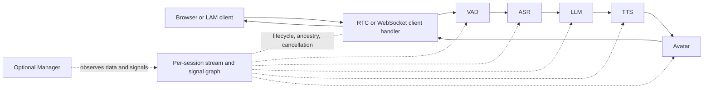

# OpenAvatarChat 技术报告

**语言：** 简体中文 · [English](../technical-report.md)

## 1. 执行摘要

OpenAvatarChat 0.6.0 是一套模块化的实时数字人服务，由配置决定启用哪些处理程序。
浏览器或 LAM 客户端输入音频、视频或文本，引擎再将类型化数据流依次交给
VAD、ASR、LLM、TTS 和数字人处理程序，最后通过 WebRTC 或 WebSocket 返回结果。
`standard`（标准）与 `duplex`（双工）对话模式共用同一套处理程序契约；
双工模式额外提供类型覆盖、语句结束检测和中断处理。

该架构适合运行在单进程、GPU 加速的交互式服务中，并具备多项有助于保证正确性的设计：

- 处理程序接口将进程范围的模型加载与每会话上下文分离；
- 流身份、祖先关系、生命周期信号和取消都是显式的；
- 已取消的数据在分发前和消费前均受到保护；
- 会话历史和 Manager 缓冲区默认有界；
- Git 子模块固定到提交；
- 提供存活、就绪和版本端点；
- 可从预设推导依赖项/模型选择。

如果没有额外的补偿性控制，当前部署方案尚未达到生产就绪要求。主应用没有身份验证；
Manager 前端虽然提供令牌输入界面，后端却不会验证令牌；随附的 TURN 配置既不安全，
连接方式也有误；TLS 在证书缺失时会静默回退到明文；模型未经校验，
而 `torch.load` 又在全局启用了不安全模式；此外，仅凭受版本控制的文件无法复现依赖解析结果。
在多会话或慢客户端场景下，生命周期管理与背压机制也存在缺口，
进程还会以退出码 `0` 掩盖启动失败。

这是一项生产就绪性评估，并不表示项目无法使用。验证所选预设、模型、凭据和网络路径后，
可以在受控的 Linux GPU 主机上采用原生或 Docker 部署方式。面向公网运行前，
必须满足[部署指南](deployment-guide.md)列出的生产门槛。

## 2. 审查范围、方法与排除项

### 2.1 纳入审查范围

- 根清单、安装程序、模型下载器、Dockerfile、Compose 文件、shell 辅助程序、TLS 和 coturn 配置；
- 全部 13 个已检入的 YAML 预设；
- 第一方引擎、会话、流、信号、客户端、服务、处理程序和 Manager 代码；
- 预构建前端边界及前端构建/类型检查状态；
- 处理程序依赖清单和全部八个 Git 子模块边界；
- 中英文项目文档，并以英文文档作为主要部署基线；
- 审查时有效的 CUDA、NVIDIA Container Toolkit、Docker Compose、
  浏览器安全上下文、WebRTC/TURN 和 coturn 权威资料。

### 2.2 作为外部依赖处理

以下是固定的子模块或第三方树，未接受完整的独立实现审计：

| 边界 | 检出的提交 |
|---|---|
| SoulX-FlashHead | `c2b0b0fb696c58c20917b50a9c572a6ac9414233` |
| LAM_Audio2Expression | `aa5bc3487ac2c915db2ff43d05d9f563cb62864d` |
| LiteAvatar | `5b7ec850945e03d56fb290b05fb68440c359fa86` |
| MuseTalk | `67e7ee3c7397bcfd03e123398e5497f31be1bf92` |
| CosyVoice | `0a496c18f78ca993c63f6d880fcc60778bfc85c1` |
| Silero VAD | `9060f664f20eabb66328e4002a41479ff288f14c` |
| Smart Turn | `7392230c2627503d0cefcaa79d60e5adbb381a54` |
| OpenAvatarChat WebUI | `a6182afbda3f3b84a6608402a41e55a0c7bc6766` |

根仓库控制这些组件如何加载、配置和对外提供服务。因此，即使上游算法不在审查范围内，
这些组件与主项目之间的集成边界仍属于本次审查范围。

### 2.3 未进行端到端验证

当前检出版本不包含模型文件，审查环境也没有生产凭据、浏览器、可达的 TURN 服务器
或已确认可用的 NVIDIA GPU。因此，本次审查没有：

- 下载数 GB 的模型或依赖项；
- 调用付费 LLM、ASR、TTS 或托管 TURN API；
- 启动完整媒体服务；
- 构建或启动 CUDA 容器；
- 跨真实 NAT 演练浏览器 WebRTC；
- 测量延迟、吞吐量、GPU 内存或多会话容量。

现有文档的延迟和 VRAM 数值是历史项目声明，而非在本审查中复现的结果。

## 3. 仓库与交付结构

| 路径 | 角色 |
|---|---|
| `src/demo.py` | CLI 和应用进程入口点 |
| `src/chat_engine/` | 处理程序发现、会话生命周期、流/信号图、数据模型 |
| `src/handlers/` | 客户端、VAD、ASR、LLM、TTS、数字人、Manager 和 Beta Agent 集成 |
| `src/service/` | 前端挂载、RTC/TURN 提供程序、Manager 服务、配置、TLS 与日志 |
| `config/` | 环境范围的运行时预设 |
| `scripts/` | 模型与数字人资源下载、TLS 创建、coturn 设置 |
| `resource/` | 运行时挂载或复制的数字人资源 |
| `models/` | 下载的模型根目录；由 Git 忽略 |
| `build/` 与 `exp/` | 构建产物和运行时输出 |
| `extensions/openclaw/` | 可选的 Beta 桥接；不属于核心部署路径 |
| `docs/` | VitePress 用户文档 |
| `Dockerfile` | CUDA 12.8.1 全处理程序镜像 |
| `docker-compose.yml` | 使用主机网络模式的应用与 coturn 编排脚手架 |

由于子模块和本地环境已经填充，审查环境中的源代码目录约为 9.3 GB。
这不是镜像大小或部署磁盘用量的估算值；模型目录目前为空，
生产模型还会增加大量存储需求，具体取决于所选预设。

## 4. 运行时架构

### 4.1 数据流



各处理程序通过类型化数据连接，而不是通过硬编码的调用链耦合。
处理程序声明自己消费和产生的 `ChatDataType` 值，会话据此创建输入端（sink）
和输出流（streamer）。因此，生产者不需要了解消费者的具体类型，
便可将数据分发给所有符合条件的消费者。

源代码位置：

- 处理程序契约：[`handler_base.py`](../../src/chat_engine/common/handler_base.py#L16)；
- 会话路由：[`chat_session.py`](../../src/chat_engine/core/chat_session.py#L216)；
- 流图：[`stream_manager.py`](../../src/chat_engine/core/stream_manager.py#L183)。

### 4.2 启动序列

1. `src/demo.py` 解析 `--host`、`--port`、`--config` 和 `--env`。
2. 存在时，`OPEN_AVATAR_CHAT_CONFIG` 替换 CLI 配置路径。
3. Dynaconf 加载请求的环境和 `.env`。
4. Pydantic 仅验证 `logger`、`service` 和 `chat_engine`。
5. 配置日志记录器，使其输出到 stdout，并将 `logs/log.log` 设为轮转日志。
6. 创建 FastAPI 和一个 Gradio 占位符。
7. `ChatEngine.initialize()` 导入、验证、注册并加载处理程序。
8. 客户端和 Manager 处理程序挂载路由与前端资源。
9. 引擎将自身标记为就绪。
10. 检查 TLS 路径；仅当两个文件都存在时，Uvicorn 才使用 TLS 启动。

源代码位置：

- CLI 和进程：[`demo.py`](../../src/demo.py#L23)；
- 配置加载：[`service_config_loader.py`](../../src/service/service_utils/service_config_loader.py#L12)；
- 处理程序加载：[`handler_manager.py`](../../src/chat_engine/core/handler_manager.py#L38)；
- TLS 选择：[`ssl_helpers.py`](../../src/service/service_utils/ssl_helpers.py#L9)。

需要特别注意启动顺序：处理程序初始化完成后，就绪状态会被设为 `true`。
但这并不验证 TURN 是否可达、模型是否完整、证书是否有效、外部 API 凭据是否可用，
也不验证浏览器端媒体链路。

### 4.3 配置语义

所有随附文件都包含一个 `default` Dynaconf 环境。有效对象为：

```text
default.logger        -> LoggerConfigData
default.service       -> ServiceConfigData
default.chat_engine   -> ChatEngineConfigModel
```

关键行为：

- 相对配置路径从项目根目录解析；
- 相对模型路径在引擎初始化期间转换为绝对路径；
- `handler_search_path` 控制动态本地模块发现；
- 处理程序配置首先解析为通用基类，随后在注册期间解析为处理程序自身模型；
- `enabled: false` 阻止注册和依赖项/模型选择；
- `input_type_override` 和 `output_type_override` 可让普通处理程序适配 `duplex` 数据类型；
- 引擎级别的 `concurrent_limit` 会复制到每个已注册处理程序，覆盖任何处理程序级别值；
- 自定义配置文件和 `.env` 是可信输入，因为它们控制模块加载、端点、凭据、模型路径和提示词。

Pydantic 中的服务回退值为 `127.0.0.1:8080`，但随附预设都会显式绑定
`0.0.0.0:8282`；Beta Agent 预设例外，它绑定 `0.0.0.0:8283`。
因此，部署文档应以预设行为为准，不能把 Pydantic 的回退值当作实际部署默认值。

`duplex` 预设中的顶层 `history` 块不会被加载到任何已验证的配置对象中。
会话仍使用硬编码默认值构造 `SessionHistory`。参见审查发现 F-12。

### 4.4 处理程序生命周期

处理程序有两个范围：

- **进程级** — 仅构造、注册并调用一次 `load()`；计算开销较大的模型通常保存在这里；
- **会话级** — 由 `create_context()`、`start_context()`、`handle()` 和
  `destroy_context()` 管理单次会话的状态。

加载顺序由 `HandlerBaseInfo.load_priority` 决定。Manager 处理程序可以较早加载，
以便观察数据；客户端处理程序则在所有非客户端处理程序之后完成准备，
确保媒体开始传输前会话路由已经可用。

首次通用模型遍历中发现的处理程序配置验证错误只会被记录并跳过，不会阻止启动；
模块导入失败或处理程序加载失败则会继续向上抛出。由于不同错误采用不同的处理策略，
运维人员必须检查启动日志，并核对实际注册的处理程序是否与预期一致。

代码中虽然存在独立的 `LogicManager`，但 `ChatEngine._create_session()` 内创建会话逻辑的代码
已被注释。当前预设通过 `src/handlers/logic/` 下的处理程序实现中断逻辑，
并未启用 `LogicManager` 图。

### 4.5 会话、线程和关闭

每个会话拥有：

- 单调会话时钟；
- 一个共享的 `active` 标志；
- 一个带分发线程的 `SignalManager`；
- 一个 `StreamManager`；
- 每个启用的处理程序各有一个输入队列和一个非守护队列处理线程（pump thread）；
- 每会话处理程序上下文；
- 内存中的 `SessionHistory`。

处理程序线程每 30 ms 轮询一次队列。它会捕获 `handler.handle()` 抛出的异常，
然后继续处理下一项。`SignalManager` 不会捕获信号监听器抛出的异常，
因此单个监听器失败就可能终止该会话的信号分发线程。

停止会话时，系统会清除 `active` 标志，等待每个队列处理线程结束，
销毁处理程序上下文，停止信号线程，清除处理程序，并调用当前为空实现的
`SessionContext.cleanup()`。关闭整个引擎时，系统会销毁进程级处理程序，
却不会遍历并停止 `ChatEngine.sessions` 中的活动会话。因此，进程退出时的媒体会话清理
依赖客户端或框架的拆除顺序。

模块退出时，`src/demo.py` 会在 `finally` 块中无条件调用 `os._exit(0)`。
这会绕过正常的异常传播、析构和缓冲区刷新，并让 shell 与监督程序把启动或运行时异常
误判为成功。使用缺失配置进行的启动探针已经复现了退出码为 `0` 的问题。

源代码位置：

- 会话启动/停止：[`chat_session.py`](../../src/chat_engine/core/chat_session.py#L334)；
- 信号线程：[`signal_manager.py`](../../src/chat_engine/core/signal_manager.py#L20)；
- 引擎关闭：[`chat_engine.py`](../../src/chat_engine/chat_engine.py#L107)。

该架构假定每个实例只运行一个应用进程。启动多个 Uvicorn worker 会分别创建模型实例、
会话字典、Manager hub 和 GPU 分配，却没有共享路由或会话亲和性支持。
因此，多 worker 并不是受支持的扩展方式。

### 4.6 数据流、取消与双工行为

一个流记录：

- 生产者和数据类型；
- 生命周期状态；
- 直接源流；
- 有序祖先；
- 可取消祖先；
- 下游引用；
- 普通和可继承元数据。

取消状态可以沿数据流图传播。系统会在输入端分发前检查数据流是否已取消，
并在消费者调用处理程序前再次检查。这样既能拦截生产者迟到的写入，
也能丢弃中断发生前已经进入队列的数据。

完成的流会短暂保留，以允许下游处理程序链接祖先关系。流存储会定期回收无引用的已完成/已取消流。

`standard` 模式的数据流大致如下：

```text
MIC_AUDIO -> Silero VAD -> HUMAN_AUDIO -> ASR -> HUMAN_TEXT
HUMAN_TEXT -> LLM -> AVATAR_TEXT -> TTS -> AVATAR_AUDIO
AVATAR_AUDIO -> avatar -> AVATAR_VIDEO + AVATAR_AUDIO -> client
```

`duplex` 模式增加连续 VAD、`HUMAN_DUPLEX_AUDIO`、`HUMAN_DUPLEX_TEXT`、
Smart Turn EOU、语义中断判断、会话历史和中断信号。借助类型覆盖，
SenseVoice 等普通处理程序无需修改内部契约，也能处理 `duplex` 数据类型。

### 4.7 RTC 和 WebSocket 传输

#### RTC

RTC 客户端挂载 FastRTC 双向音频/视频服务。它使用：

- 麦克风输入：16 kHz、单声道；
- 数字人音频输出：24 kHz、每帧 480 个采样点；
- 浏览器相机输入和数字人视频输出；
- 配置的视频 FPS；
- 0.5 秒的媒体启动延迟；
- 连接 TTL，通常为 900 秒；
- 可选 ICE/TURN 配置。

音频和视频输出由处理程序线程写入 `asyncio.Queue`，再由 WebRTC 事件循环消费。
这些队列没有容量上限，生产者也没有通过线程安全的事件循环桥接写入，
因此慢客户端和并发访问会带来显著风险（F-06）。

#### WebSocket 和 LAM

通用 WebSocket 客户端和 LAM 客户端都提供 `/ws/session/{session_id}`。
连接到不存在的会话时会自动创建会话，但系统没有通过身份验证或授权
把会话 ID 绑定到特定用户。

LAM 支持：

- `rtc`：上行传输浏览器音频和视频，下行通过 WebSocket 传输动作数据；
- `ws` 用于纯 WebSocket 输入/输出；
- `/download/lam_asset/{file_name}` 用于下载配置指定的资源包。

LAM 资源路由将文件名限制在保守字符集内，并检查规范化后的路径，
可有效降低路径遍历风险。

### 4.8 状态和持久化

| 状态 | 位置 | 持久性 |
|---|---|---|
| 活动会话 | 进程内存（`ChatEngine.sessions`） | 重启时丢失 |
| 流图 | 每会话内存 | 会话停止/重启时丢失 |
| `standard` LLM 历史 | 每会话处理程序上下文 | 重启时丢失 |
| `duplex` 会话历史 | 每会话内存 | 重启时丢失；持久化方法尚未实现 |
| Manager 最近事件 | 进程内存，有界双端队列（`deque`） | 重启时丢失 |
| Manager 音频/图像 | `temp/data_tool/<session>/` | 文件会一直保留，需由外部清理 |
| 日志 | stdout 和 `logs/log.log*` | 依赖文件/容器日志保留策略 |
| 模型 | `models/` 和处理程序特定路径 | 持久卷/本地磁盘 |
| 数字人资源 | `resource/` | 持久卷/本地磁盘 |
| 构建/实验输出 | `build/`、`exp/` | 仅在挂载时持久 |

Manager 上下文会把缓冲区标记为过期，但只有当会话数超过服务限制时才触发清理。
审查范围内的代码没有为临时媒体文件实现自动保留期限或清理机制。

### 4.9 HTTP 接口与网络暴露面

| 接口或服务 | 默认路径/端口 | 应用内身份验证 | 说明 |
|---|---|---|---|
| 主界面 | `/` -> `/ui/index.html` | 无 | 前端 `dist` 缺失时回退到 `/gradio` |
| 前端资产 | `/ui/*` | 无 | 预构建子模块输出 |
| 前端初始化配置 | `/openavatarchat/initconfig` | 无 | 可能包含 ICE/TURN 凭据 |
| Gradio 占位符 | `/gradio` | 无 | 即使有外部 UI 也会挂载 |
| 版本 | `/version` | 无 | 硬编码为 `0.6.0` |
| 存活检查 | `/liveness` | 无 | 仅检查进程级响应 |
| 就绪检查 | `/readiness` | 无 | 仅反映引擎初始化状态 |
| FastRTC 信令/媒体 | FastRTC 挂载的路由 | 项目中无 | 会消耗 GPU/API 资源的会话入口 |
| 通用/LAM 会话 | `/ws/session/{session_id}` | 无 | 创建/复用会话 |
| LAM 资产 | `/download/lam_asset/{file_name}` | 无 | 所选配置存档 |
| Manager 流 | `/ws/manager/data_tool` | 无 | 全会话快照和远程中断 |
| Manager 文件 | `/download/manager/data_tool/file` | 无 | 限制到 `temp/data_tool`，但未访问控制 |
| 应用监听器 | TCP `8282` | 无 | Beta Agent 预设使用 `8283` |
| TURN | UDP/TCP `3478` | TURN 凭据 | TLS 监听器 TCP `5349` |
| TURN 中继 | 预期 UDP `49152-65535` | TURN 权限 | 必须匹配实际 coturn 配置/防火墙 |

Manager 前端会保存一个可选令牌，并把它附加到 HTTP 请求或 WebSocket 查询字符串中，
但 Python 后端不会验证这两种令牌。因此，英文 Manager 文档中提到的身份验证
并不是已经实现的服务端控制。

## 5. 组件与预设矩阵

### 5.1 处理程序系列

| 阶段 | 存在的实现 |
|---|---|
| 客户端 | FastRTC、通用 WebSocket、LAM WebSocket/RTC |
| VAD / EOU | Silero 标准模式、Silero 双工模式、Smart Turn |
| ASR | SenseVoice 本地、Bailian streaming |
| LLM / S2S | OpenAI-compatible、Dify、Qwen-Omni、语义轮次检测器 |
| TTS | Bailian CosyVoice、本地 CosyVoice、Edge TTS |
| 数字人 | 无数字人模式、LiteAvatar、LAM、MuseTalk、FlashHead |
| 运维 | 中断处理程序、可选 Manager 数据工具 |
| Beta 功能 | Perception/Chat Agent 与 OpenClaw 桥接 |

### 5.2 已检入预设

下表中的“运行时配置”指实际的 Dynaconf/Pydantic 配置加载流程，
而不只是安装程序使用 PyYAML 独立完成的依赖扫描。

| 预设 | 客户端 / 模式 | ASR | 响应 | 数字人 | 限制 | 运行时配置 |
|---|---|---|---|---|---:|---|
| `chat_with_openai_compatible_bailian_cosyvoice.yaml` | RTC 标准模式 | SenseVoice | OpenAI-compatible + Bailian TTS | LiteAvatar | 2 | 有效 |
| `chat_with_openai_compatible_bailian_cosyvoice_duplex.yaml` | RTC 双工模式 | SenseVoice | OpenAI-compatible + Bailian TTS | LiteAvatar | 2 | 有效 |
| `chat_with_openai_compatible.yaml` | RTC 标准模式 | SenseVoice | OpenAI-compatible + 本地 CosyVoice | LiteAvatar | 默认 1 | 有效 |
| `chat_with_openai_compatible_edge_tts.yaml` | RTC 标准模式 | SenseVoice | OpenAI-compatible + Edge TTS | LiteAvatar | 1 | 有效 |
| `chat_with_openai_compatible_bailian_cosyvoice_musetalk.yaml` | RTC 标准模式 | SenseVoice | OpenAI-compatible + Bailian TTS | MuseTalk | 1 | 有效 |
| `chat_with_openai_compatible_bailian_cosyvoice_musetalk_duplex.yaml` | RTC 双工模式 | SenseVoice | OpenAI-compatible + Bailian TTS | MuseTalk | 3 | 有效，但容量未验证 |
| `chat_with_openai_compatible_bailian_cosyvoice_flashhead.yaml` | RTC 标准模式 | SenseVoice | OpenAI-compatible + Bailian TTS | FlashHead | 1 | 有效 |
| `chat_with_openai_compatible_bailian_cosyvoice_flashhead_duplex.yaml` | RTC 双工模式 + Manager | SenseVoice | OpenAI-compatible + Bailian TTS | FlashHead | 1 | 有效；必须保护 Manager |
| `chat_with_lam.yaml` | LAM WebSocket 标准模式 | SenseVoice | OpenAI-compatible + Bailian TTS | LAM | 5 | 有效，容量未验证 |
| `chat_with_lam_duplex.yaml` | LAM WebSocket 双工模式 | SenseVoice | OpenAI-compatible + Bailian TTS | LAM | 5 | 有效，容量未验证 |
| `chat_with_lam_bailian_asr_duplex.yaml` | LAM WebSocket 双工模式 + Manager | Bailian ASR | OpenAI-compatible + Bailian TTS | LAM 驱动/无数字人路径 | 5 | 有效；必须保护 Manager |
| `chat_with_qwen_omni.yaml` | RTC 标准模式 | SenseVoice + Qwen S2S | Qwen-Omni 音频/文本 | LiteAvatar | 1 | **无效：`connection_ttl` 重复** |
| `chat_with_openai_compatible_bailian_cosyvoice_flashhead_duplex_agent.yaml` | RTC 双工 Beta 模式 | SenseVoice | Chat Agent + Bailian TTS | FlashHead | 1 | 原生方式有效；容器存在限制 |

安装程序的试运行（`dry-run`）能够解析全部 13 个预设的依赖项，
因为 PyYAML 会静默保留重复键中的后一个值；Dynaconf 则会拒绝 Qwen 预设。
因此，这两项检查缺一不可。

### 5.3 Beta Agent 与 OpenClaw 的集成边界

Beta 预设使用端口 `8283`，并可在 `8011` 启动回调监听器，回调令牌默认为空。
Dockerfile 不会把 `src/handlers/agent/pyproject.toml` 复制到依赖发现层，
因此镜像内的 `install.py --all` 不会安装相应的 `mcp` 依赖项。
在解决容器依赖和回调安全问题前，该预设仅适合原生开发环境。

此处不包含更多 OpenClaw 运维细节，因为它不是本审查的关键部署目标。

## 6. 模型、依赖项和构建行为

### 6.1 Python/CUDA 契约

- Python：`>=3.11.7,<3.12`。
- PyTorch/Torchvision/Torchaudio：`2.8.0` / `0.23.0` / `2.8.0`。
- PyTorch wheel 包索引：CUDA 12.8。
- 容器基础镜像：CUDA `12.8.1`、cuDNN 开发镜像、Ubuntu 22.04。
- ONNX Runtime GPU：约 `1.20.2`。

根包名称与版本（`open-video-chat` 0.1.0）、应用端点版本（0.6.0）
和镜像 `APP_VERSION`（由构建脚本根据 Git 分支/提交生成）是三套不同的标识。
发布与回滚流程必须记录 Git 提交和镜像摘要，不能只依赖单个版本字符串。

### 6.2 依赖项安装

`install.py`：

1. 从一个或多个配置定位处理程序目录，或扫描全部处理程序清单；
2. 使用逐行解析器读取每个处理程序的依赖项列表；
3. 应用全局版本覆盖，并将 CPU 包替换为 GPU 版本；
4. 注入受保护的 Torch 版本；
5. 一起安装普通 requirements；
6. 在关闭构建隔离的情况下安装 `flash-attn`/`openai-whisper`；
7. 安装 Hugging Face 下载工具。

这种方式有助于处理版本冲突，但并不等于锁定依赖解析结果。
`uv.lock` 被 Git 忽略，也被排除在 Docker 构建上下文之外。
因此，即使本地锁文件是最新的，也无法让源代码交付具备可复现性。

镜像会安装所有已复制处理程序清单中的依赖项，而不只安装目标预设所需的依赖。
这会增加构建时间、原生扩展的复杂度、攻击面和镜像体积。
未来的生产构建应采用按预设拆分的镜像或可选依赖组。

Docker 构建上下文还会根据 `.dockerignore` 中的宽泛规则排除所有 `*.yaml` 和 `*.yml`。
这些规则同样作用于 `src/`，并不只针对 Kubernetes 文件。例如，FlashHead 在加载模块时
会导入 `flash_head/configs/infer_params.yaml`，但该文件在 `COPY ./src` 前就已被排除。
LiteAvatar、MuseTalk、本地 CosyVoice 和其他子模块也包含运行时 YAML。
因此，标准镜像构建成功并不能证明复制进去的处理程序能够运行。

### 6.3 模型位置

| 处理程序 | 重要位置 |
|---|---|
| LiteAvatar | 处理程序子模块 `weights/`；目标数字人资源位于 `resource/avatar/liteavatar/<id>/` 下 |
| LAM | `models/wav2vec2-base-960h`、`models/LAM_audio2exp` |
| MuseTalk | `models/musetalk`、`models/sd-vae`、`models/face-parse-bisent`、S3FD 缓存 |
| Smart Turn | 精确预设路径 `models/smart_turn/smart-turn-v3.1-cpu.onnx` |
| FlashHead | `models/SoulX-FlashHead-1_3B`、`models/wav2vec2-base-960h` |

下载程序支持 ModelScope、Hugging Face、第三方 Hugging Face 镜像源、
Git clone、OSS 和直接解压归档文件，但不会固定不可变的模型修订版本，
也不会校验产物摘要。

## 7. 安全、隐私和信任边界

### 7.1 可信输入

- 仓库源代码和固定的子模块提交；
- 所选 YAML 配置及其动态模块路径；
- `.env` 和进程环境；
- 本地挂载的模型和数字人资源；
- TLS/TURN 配置和凭据；
- 预构建前端文件。

### 7.2 不可信输入

- 浏览器/WebSocket 客户端及其媒体/文本/会话 ID；
- 公共 HTTP/WebSocket 请求；
- 上游 LLM/TTS/ASR 输出；
- 模型注册表、镜像和可变模型产物；
- 端点公开时的 Manager 查看者；
- 通过 TURN 可达的远程对等方。

### 7.3 密钥路径

普通预设读取 `DASHSCOPE_API_KEY`；可选路径还会读取 `DIFY_API_KEY`、
`SEMANTIC_LLM_EAS_TOKEN` 和 `INTERRUPT_JUDGE_LLM_EAS_TOKEN`。
TURN 用户名、密码和提供商令牌也属于运行时密钥。

启用 Manager 时，不要把 API 密钥直接写入 YAML。`HandlerDataTool` 会序列化
`engine_config`，任意 WebSocket 客户端都能收到当前配置快照。
TURN 配置也会完整写入 INFO 日志，包括静态凭据。密钥应在运行时注入，
从配置快照和日志中排除，并通过文件权限或容器密钥机制加以保护。

### 7.4 会话数据

标准 LLM 处理程序会把完整的用户输入和响应片段写入 INFO 日志。
Manager 模式会保存文本、音频和图像观察数据，并把媒体文件写入 `temp/data_tool`。
Beta Agent 还会记录部分记忆回写内容。因此，生产环境必须明确规定转录文本、
媒体和日志的保留期限与访问策略。

<a id="prioritized-findings"></a>

## 8. 按优先级排序的审查发现

严重级别反映按照现有文档部署时可能产生的影响。除非另有说明，
以下审查发现均为高置信度。

### F-01 — 严重：公网服务没有身份验证或准入控制

**证据：**预设绑定 `0.0.0.0`；FastRTC 与前端路由分别在
[`client_handler_rtc.py`](../../src/handlers/client/rtc_client/client_handler_rtc.py#L402)
和 [`frontend_service.py`](../../src/service/frontend_service/frontend_service.py#L58)
中挂载，均未配置身份验证。

**触发条件：**直接公开 `8282`/`8283`，包括通过文档中的端口映射。

**影响：**匿名用户可以消耗 GPU 容量和付费 API 凭据，占用较低的并发限制，并使用对话服务。

**所需门槛：**经身份验证的 TLS 入口、会话准入、速率/并发限制，以及阻止直接访问应用监听器的防火墙。

### F-02 — 高：Manager 身份验证只停留在前端

**证据：**前端会附加已保存的令牌，但
[`data_tool_service.py`](../../src/service/manager_service/data_tool_service.py#L106)
接受所有 WebSocket 连接；
[`manager_service_register.py`](../../src/service/manager_service/manager_service_register.py#L54)
提供文件下载时也没有身份验证依赖。

**触发条件：**启用 `Manager` 并公开服务。

**影响：**任何客户端都能接收全部会话快照和当前配置、下载已知路径下的临时媒体，
并远程中断会话。直接写入处理程序配置的 API 密钥可能随配置快照一同泄露。
每个 Manager 订阅者还会获得一个无界异步队列；生成媒体路径时，
代码会把未经验证的会话 ID 拼接到名义上的基目录下。根据客户端或代理的路径处理方式，
精心构造的 ID 可能越出该目录。

**所需门槛：**在生产环境中隔离或禁用 Manager；
如需启用，则必须在入口层或应用层对 WebSocket 与下载路径强制执行服务端授权。
同时限制订阅者队列，并在预期基目录内规范化和验证会话文件路径。

### F-03 — 高：仓库中的 coturn 凭据与暴露配置不安全

**证据：**[`turnserver.conf`](../../coturn-data/turnserver.conf#L1)
包含 `admin:admin` 并监听所有接口，Compose 还使用主机网络模式；
`setup_coturn.sh` 则会写入 `username:password`。

**触发条件：**在公网可达的主机上启动随附的 TURN 服务。

**影响：**任何人都能使用公开的静态凭据，可能导致中继和带宽被滥用，
甚至耗尽服务资源。

**所需门槛：**使用唯一、可轮换或限时的凭据；明确设置 realm 与监听地址；
配置配额、有界中继范围、对等方限制、防火墙规则和日志监控。
绝不能部署仓库中的默认凭据。

### F-04 — 高：Compose 中的 TURN/TLS 配置错误，且未向客户端下发

**证据：**[`docker-compose.yml`](../../docker-compose.yml#L10)
把 `localhost.crt` 同时挂载为 TURN 证书和私钥。目标应用配置没有 `turn_config`；
[`client_handler_rtc.py`](../../src/handlers/client/rtc_client/client_handler_rtc.py#L402)
也只有在提供该配置时才会发送 ICE 配置。

**触发条件：**执行 `docker compose up`，并期望公网或 NAT 后的 WebRTC 客户端能够连接。

**影响：**TURN-over-TLS 无法加载有效私钥，浏览器也收不到 TURN 服务器配置；
处于受限 NAT 后的客户端仍可能无法连接。

**所需门槛：**挂载真正的私钥，修正并验证 coturn 配置，
添加 `RtcClient.turn_config`，再从外部网络验证 ICE 中继候选项。

### F-05 — 高：不安全的模型反序列化叠加未校验的可变下载

**证据：**[`demo.py`](../../src/demo.py#L31) 会在全局强制调用
`torch.load(..., weights_only=False)`，除非调用方明确传入 `True`；
[`download_models.py`](../../scripts/download_models.py#L134)
既不固定模型修订版本，也不验证校验和。

**触发条件：**从遭入侵的模型仓库或镜像源加载文件，或加载被修改的模型卷和非预期产物。

**影响：**兼容 pickle 格式的恶意模型可以服务用户身份执行代码；
容器目前以 root 用户运行，并能访问密钥和挂载数据。

**所需门槛：**使用经过校验的不可变产物、安全格式或 `weights_only=True`；
隔离无法替换的旧式模型，并以非 root 用户运行服务。

### F-06 — 高：RTC 队列无界，且跨线程写入不安全

**证据：**处理程序线程在
[`client_handler_rtc.py`](../../src/handlers/client/rtc_client/client_handler_rtc.py#L563)
中调用 `asyncio.Queue.put_nowait()`，WebRTC 事件循环则在
[`rtc_stream.py`](../../src/service/rtc_service/rtc_stream.py#L161) 中等待这些队列。

**触发条件：**正常的并发输出或卡顿/缓慢客户端。

**影响：**丢失唤醒或发生竞态时，媒体传输可能停滞；
排队的音频和视频还可能无限增长，最终耗尽内存。

**所需门槛：**采用线程安全的事件循环写入方式、有界队列、过期视频帧丢弃策略、
有界音频延迟，并覆盖慢客户端场景测试。

### F-07 — 高：Docker 构建上下文会排除处理程序所需的运行时 YAML

**证据：**[`.dockerignore`](../../.dockerignore#L164)
会在整个构建上下文中排除 `*.yaml` 和 `*.yml`，Dockerfile 随后才复制 `src`。
FlashHead 会明确切换到其子模块，因为上游导入需要打开
`flash_head/configs/infer_params.yaml`；这一必需文件正好匹配忽略规则。

**触发条件：**构建标准镜像，并启用源代码或运行时资源中包含 YAML 的处理程序。

**影响：**镜像可能成功构建，却在导入处理程序或初始化模型时失败。
FlashHead 已确认依赖相应 YAML；其他多个随附子模块也包含 YAML 资源，
需要按预设逐一验证。

**所需门槛：**把忽略规则限定在确实不需要打包的路径，
或重新纳入 `src` 下的运行时 YAML；随后逐一检查并测试最终镜像中的目标处理程序。

### F-08 — 中：随附预设中的 RTC 与数字人 FPS 不一致，需要集成验证

**证据：**`ClientRtcConfigModel` 要求输出 FPS 与数字人处理程序匹配。
MuseTalk 会强制校验相等，其预设设置为 `24`/`24`；其他数字人模式没有同类运行时保护。
大多数 LiteAvatar 和非 Agent 的 FlashHead 预设将数字人 FPS 设为 `25`，
而 RTC 仍保留默认值 `30`。

**触发条件：**以不匹配预设之一运行持续对话。

**影响：**调度过程可能重复或丢弃帧，也可能偏离 24 kHz 音频时序。
本次审查没有通过运行时测试确认实际可见影响。

**所需门槛：**明确设置两个值且相等，然后运行长时 A/V 同步测试。添加跨处理程序配置验证。

### F-09 — 中：TLS 配置失败后仍会回退到明文

**证据：**[`ssl_helpers.py`](../../src/service/service_utils/ssl_helpers.py#L19) 记录缺失文件并返回无 SSL 设置。

**触发条件：**一个或两个证书文件缺失或挂载错误。

**影响：**`0.0.0.0` 服务仍会通过 HTTP 启动；远程浏览器媒体权限失败，或运维人员意外公开明文流量。

**所需门槛：**对非回环地址部署执行明确的前置检查，并在 TLS 配置无效时阻止启动；
优先在入口代理处终止受信任 TLS。

### F-10 — 中：构建无法复现

**证据：**依赖版本范围过宽、直接执行 `uv pip install`、`uv.lock` 被忽略、
`uv` 版本浮动、基础镜像标签来自浮动镜像源，以及 coturn 镜像未固定。

**触发条件：**在上游依赖、镜像或包索引发生变化后重新构建。

**影响：**源等价构建可能不同或无法继续构建；回滚和事件重建变得不可靠。

**所需门槛：**纳入版本控制且经过审查的锁文件或约束、锁定安装、
镜像摘要、产物哈希、SBOM、来源证明和不可变发布标识。

### F-11 — 中：模型下载成功检查不完整

**证据：**LiteAvatar、LAM 和 FlashHead 下载路径可在被忽略的命令失败后返回成功；Smart Turn 接受任意 ONNX 文件，而预设要求特定文件名。

**触发条件：**已存在中断/部分下载或不同 ONNX 变体。

**影响：**安装过程看似成功，随后却在模型加载或首次推理时失败。

**所需门槛：**包含精确文件/摘要的预设特定清单、临时下载、原子提升，以及无网络的 `verify-models --config` 预检。

### F-12 — 中：已配置的历史保留被忽略

**证据：**`duplex` 配置定义了 `default.history`，但
[`service_config_loader.py`](../../src/service/service_utils/service_config_loader.py#L30)
不会加载它；[`chat_engine.py`](../../src/chat_engine/chat_engine.py#L69)
创建 `SessionContext` 时也没有传入 `HistoryConfig`。

**触发条件：**调整预设中的任意历史保留值。

**影响：**容量和隐私假设与运行时行为不匹配。

**所需门槛：**将该配置接入运行时并完成测试，或从运维说明中移除相关调优声明。
当前默认值为 1,000 个事件、保留一小时、每 60 秒清理一次。

### F-13 — 中：关闭和部分会话清理缺口

**证据：**引擎关闭时不会停止活动会话；客户端处理程序完成准备之前，
系统就已保存新建的会话。

**触发条件：**带活动会话的进程关闭，或客户端上下文准备失败。

**影响：**资源/线程可能依赖强制进程退出；失败启动可能留下部分注册会话，直至重启/手动清理。

**所需门槛：**在销毁处理程序前停止全部会话，使创建具备事务性，并测试 SIGTERM 及失败上下文情形。

### F-14 — 中：就绪检查与容器隔离不足

**证据：**`/readiness` 只检查 `states.inited`；镜像以 root 用户运行；
Compose 以读写方式挂载密钥、配置和模型，且没有健康检查或资源限制。

**触发条件：**缺少模型/证书/TURN/API 前提条件，或发生运行时攻破。

**影响：**流量可能被发送到功能不可用的实例；
一旦容器遭到攻破，攻击者仍可获得不必要的写入权限。

**所需门槛：**能够感知前置条件的健康检查、非 root UID、尽可能使用只读挂载、
移除不必要的 Linux capabilities、启用 `no-new-privileges`，
并限制 CPU、内存、GPU 和会话资源。

### F-15 — 中：Qwen-Omni 预设无法加载

**证据：**`connection_ttl` 同时出现在 [`chat_with_qwen_omni.yaml`](../../config/chat_with_qwen_omni.yaml#L15) 的第 17 和 19 行。Dynaconf 抛出 `DuplicateKeyError`。

**触发条件：**启动文档中的 Qwen 预设。

**影响：**启动会在配置加载阶段停止。安装程序的试运行会让人误以为配置可用，
因为其解析器只保留重复键中的后一个值。

**所需门槛：**移除重复项，并使用运行时加载器验证。

### F-16 — 中：日志会记录敏感内容和 TURN 凭据

**证据：**标准 LLM 的输入和输出会写入 INFO 日志；日志会保留十份轮转文件；
RTC 提供程序还会记录完整配置，包括静态 TURN 凭据。

**触发条件：**普通会话或启用 TURN 的启动。

**影响：**转录内容和凭据进入文件/容器日志管线。

**所需门槛：**载荷脱敏、仅元数据的生产日志、密钥过滤、限制性权限，以及明确的保留/删除策略。

### F-17 — 中：进程退出码会掩盖失败并绕过清理

**证据：**[`demo.py`](../../src/demo.py#L101) 无论 `main()` 如何退出，都会在 `finally` 中调用 `os._exit(0)`。以缺失配置启动时记录了错误，却返回 shell 状态 `0`。

**触发条件：**任意启动异常、未被 `main()` 捕获的运行时异常，或服务器正常返回。

**影响：**CI、systemd `Restart=on-failure`、部署自动化和运维人员可能将失败启动视为成功。强制退出还会绕过正常清理和排队日志刷新。

**所需门槛：**保留真实的失败退出码并采用有序关闭；
测试缺失配置、无效配置、处理程序加载、SIGTERM 和正常停止时的退出码与清理行为。
修复前，部署必须要求明确的就绪证据，并采用不依赖非零退出码的重启策略。

### F-18 — 中：构建脚本会执行用户可控的命令字符串

**证据：**[`build_cuda128.sh`](../../build_cuda128.sh#L141) 将 `--tag` 和构建元数据插入 `BUILD_CMD`，随后调用 `eval`。

**触发条件：**构建管线或运维人员传入不可信/格式错误的镜像 tag。

**影响：**shell 元字符可能以构建用户权限执行命令；
Docker 用户组权限通常等同于主机 root 权限。

**所需门槛：**使用 Bash 数组构造 Docker 命令，移除 `eval`，
校验标签和镜像仓库参数，并禁止把不可信的 PR 或分支数据传入特权构建参数。

### F-19 — 低：发布标识符和文档漂移

示例包括：根包版本为 `0.1.0`，应用版本却为 `0.6.0`；
Manager 身份验证文档与实际未进行身份验证的后端不一致；
参考文档中的默认值与 Pydantic 定义不同；
构建脚本输出还提到了 Dockerfile 中未定义的 `BUILD_COMMIT` 变量。

**影响：**运维人员困惑和不可靠的支持证据。

**所需门槛：**一份包含 Git 提交、镜像摘要、应用版本、依赖锁摘要、模型清单摘要和配置摘要的发布清单。

### F-20 — 低/Beta：Agent 容器与回调默认值

Docker 依赖层遗漏了 Agent 清单；Beta 回调默认使用空令牌绑定 `0.0.0.0:8011`。

**所需门槛：**保持禁用；如需启用，则必须安装缺失依赖，
要求非空令牌、回环或私网地址绑定，以及有界队列。

## 9. 质量与测试现状

- 未发现项目自有的核心测试套件或 CI 测试任务。
- 唯一的根 CI 工作流构建/部署 VitePress 文档。
- 已声明 Pytest 依赖项，但发现的测试主要位于上游子模块中。
- 源代码语法检查范围很广，但不能证明运行时兼容性、正确的媒体时序、取消正确性或会话隔离。
- 预构建前端文件在正常部署中提供；重建前端当前有类型检查失败。

最高价值的缺失测试是：

1. 通过真实加载器验证每个预设的配置；
2. 使用模拟模型加载器构造处理程序图；
3. 两个会话之间的隔离，以及并发限制是否得到强制执行；
4. 慢速/断开 RTC 客户端背压；
5. 流取消和残余队列拒绝；
6. 带活动会话的 SIGTERM；
7. 经身份验证的公共/Manager 路由行为；
8. TURN 配置生成和外部中继 ICE 候选项；
9. 精确模型清单验证；
10. 依赖锁定的干净镜像构建。

## 10. 值得保留的优势

- 清晰的处理程序进程/会话生命周期。
- 类型化流和已验证的处理程序 I/O 声明。
- 用于复用 `duplex` 处理程序的可配置类型重映射。
- 显式的流祖先关系和取消传播。
- 生产者侧和消费者侧取消保护。
- 固定的源代码子模块，而不是检出时浮动的 Git 分支。
- Manager 下载和 LAM 资产服务的路径检查。
- 有界 Manager 事件缓冲区和会话历史默认值。
- 原生安装时限定到已启用处理程序的模型/依赖项发现。
- 前端静态交付与媒体引擎之间的分离。

生产加固应保留这些契约，而不是用第二个并行编排层绕过它们。

## 11. 就绪性结论

| 用例 | 评估 |
|---|---|
| localhost 上的开发者评估 | 在具备模型、依赖项和凭据后有条件就绪 |
| 受信任 LAN 演示 | 使用受信任 TLS 和受限防火墙后有条件就绪 |
| 位于身份验证入口后的单实例公网演示 | 只有满足 TURN、TLS、身份验证和模型门槛后才可考虑 |
| 未经身份验证直接暴露到公网 | 不可接受 |
| 生产级多用户服务 | 在完成修复、负载测试和必要的运维控制前，不具备就绪条件 |
| 横向多 worker/多节点部署 | 当前内存架构不支持 |
| Beta OpenClaw 部署 | 当前状态下次要、仅限原生开发 |
